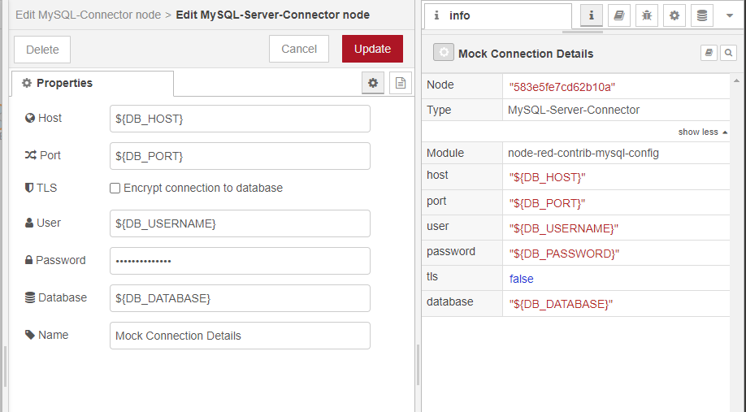

# Foreword

*Note:* All credit for this work goes to the original creator(s): [https://github.com/stackhero-io/node-red-contrib-stackhero-mysql](https://github.com/stackhero-io/node-red-contrib-stackhero-mysql)

This is a fork for the purpose of configuring a connection using environment variables. 

## Use Case

One use case for this fork is when NodeRED changes are being deployed in a CI/CD environment and you need to set login credentials from environment variables on initialisation, rather than manually configuring them in the NodeRED UI. 

## node-red-contrib-mysql-config

[Node-RED](https://nodered.org) node to read and write to a MySQL or a MariaDB database.

## Configuration

In order to configure this node, set each of the inputs with it's environment variable name. 



## Usage

This node is really simple.

Put your query in the `topic` variable and, if you have arguments, put them in an object in the `payload` variable.
You will get the result in the `payload` output variable.

Example:

```javascript
msg.topic = 'SELECT * FROM `users` WHERE `name` = :name AND `age` > :age;';
msg.payload = { name: 'Adrien', age: 30 };
return msg;
```

> Avoid SQL injections!!
>
> Do not NEVER EVER put variables content in `topic` directly!
> Always use the `payload` variable to pass your arguments.
